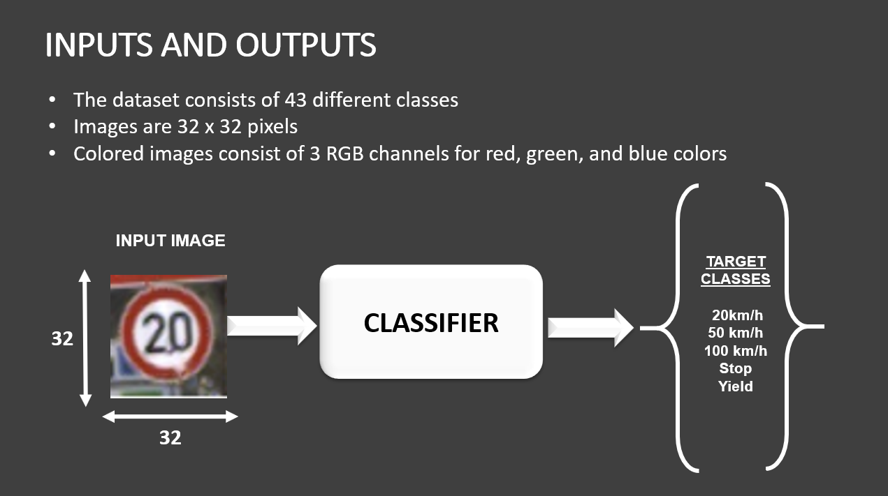

# Traffic-Signs-Classification
A deep Convolutional Neural Network (CNN) model to classify Traffic Signs.

Dataset: https://drive.google.com/open?id=1oHrQuGYYRW1OQOXy-1WwwbQXA1JB2RLh

Model Accuracy: 91%



## Prequisites:
```
  pip install tensorflow
  pip install numpy
  pip install pandas
  pip install matplotlib
  pip install seaborn
  pip install pickle-mixin
```

